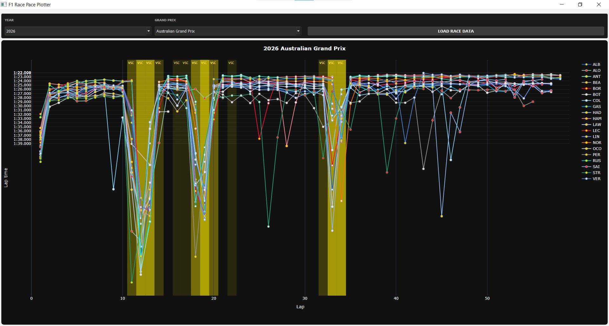
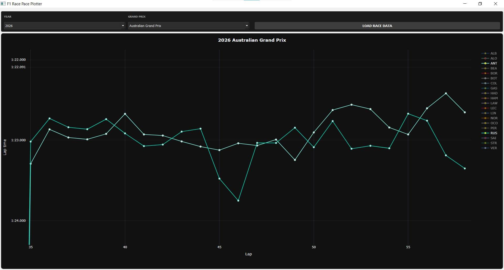

# F1 Race Pace Plotter

A desktop application for visualizing Formula 1 race pace using FastF1 and Plotly.

---

## Screenshots
All laptimes for all drivers shown


Driver vs. driver (RUS vs. ANT), zoomed in to show final stint comparison


---

## Features

* Lap time visualization for all drivers
* Safety Car (SC) and Virtual Safety Car (VSC) detection
* Tire compound color coding
* Pit stop lap indicators
* Team-based driver colors
* Interactive Plotly graph (zoom, hover, toggle)

---

## Tech Stack

* Python
* PyQt5 (GUI)
* FastF1 (data)
* Plotly (visualization)

---

## Installation

```bash
git clone https://github.com/yourusername/f1-race-pace-plotter.git
cd f1-race-pace-plotter
pip install -r requirements.txt
```

---

## Run

```bash
python main.py
```

---

## How it works

1. Select year and Grand Prix
2. Click **Load Race Data**
3. Explore lap times interactively
